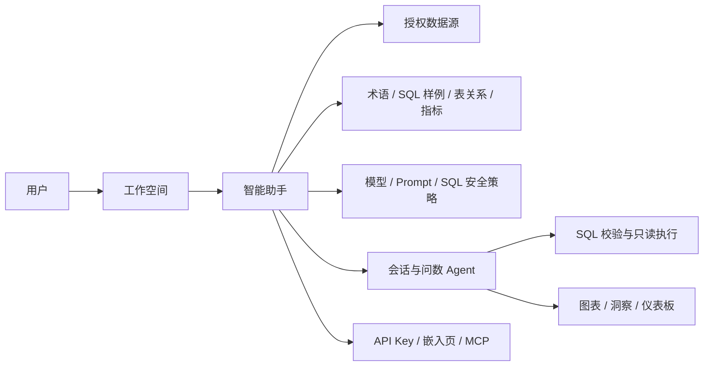

# DataPilot 企业级智能问数平台演进路线图

> 状态：规划文档  
> 更新日期：2026-07-21  
> 目标：在保留 DataPilot 现有安全问数能力的前提下，逐步演进为可用于企业内部的智能问数（ChatBI）平台。

## 1. 定位与目标

DataPilot 当前是一个安全优先的 ChatBI Agent MVP：用户输入自然语言，系统检索 Schema 和知识、生成 SQL、进行 SQLGlot AST 校验、查询数据源，并返回图表和洞察。

下一阶段不追求复制完整 BI 产品，而是完成以下产品闭环：

1. **可管理**：管理员能配置数据源、助手、指标、术语、表关系和 SQL 样例。
2. **可控制**：用户只能访问所属工作空间、被授予的助手和允许的数据。
3. **越用越准**：经管理员确认的问答可以沉淀为训练知识，而不是只依赖模型临场生成。
4. **可集成**：问数能力可通过 API Key、嵌入页和后续 MCP 接入内部系统。
5. **可运营**：平台可观测问数质量、失败原因、知识命中率和使用情况。

SQLBot 是功能与产品形态的参考对象；DataPilot 只借鉴其能力分层和产品思路，不复制其代码或品牌资源。

## 2. 现状基线

当前 DataPilot 已具备可复用的核心能力：

- LangGraph 工作流：`schema -> knowledge -> SQL -> validate -> execute -> analyze`。
- MySQL 默认、PostgreSQL 可选的数据源执行能力。
- SQLGlot AST 校验：单条 `SELECT`、禁止注释/写操作/`SELECT *`、表字段白名单、`LIMIT` 和超时。
- 指标语义层、可信 SQL、Qdrant Local 知识检索、会话上下文和查询日志。
- Vue 问答页、ECharts 图表页、基础统计页、Docker、pytest 和离线 eval。

当前定位仍是单平台 MVP，主要缺口如下：

| 领域 | 当前状态 | 企业级目标 |
| --- | --- | --- |
| 身份与隔离 | 无登录、无用户归属 | 用户、工作空间、角色、资源隔离 |
| 助手配置 | 请求直接选择数据源 | 助手统一绑定数据源、模型、Prompt、知识与策略 |
| 知识运营 | 有 RAG，但缺少配置界面 | 术语、SQL 样例、表关系、审核和重建闭环 |
| 问答体验 | 单一问答页 | 历史会话、流式进度、反馈、重试和推荐追问 |
| 展示沉淀 | 单次图表结果 | 可保存、刷新和分享的仪表板 |
| 对外集成 | 内部 REST API | API Key、嵌入页、MCP |
| 生产运维 | Qdrant Local、单实例友好 | 多实例、可观测、可迁移和可审计 |

## 3. 架构目标

平台的核心资源从“数据源 + 单次请求”升级为“工作空间 + 智能助手”。



### 3.1 智能助手（Assistant）

Assistant 是企业问数的最小可配置单元。一个 Assistant 至少包含：

- 名称、描述、所属工作空间和启用状态；
- 可访问的数据源集合；
- 模型配置或模型引用；
- 自定义系统 Prompt；
- 可用指标、术语、SQL 样例和表关系；
- 默认图表规则与查询安全策略。

用户问数时只提交 `assistant_id` 和问题。后端从 Assistant 配置取得数据源和知识边界，不再信任客户端任意指定资源。

### 3.2 企业问数工作流

```text
身份校验
  -> 工作空间和助手授权
  -> 选择已授权数据源
  -> 检索 Schema / 表关系 / 指标 / 术语 / SQL 样例
  -> 生成 SQL
  -> SQLGlot AST 校验（最终门禁）
  -> 用只读账号执行查询
  -> 生成图表、洞察和回答
  -> 保存会话、执行日志、反馈和可审核训练候选
```

不允许因为可信 SQL、RAG 结果、Prompt 或管理员配置而绕过 SQL AST 校验和数据源只读权限。

## 4. 演进原则

1. **先治理，再扩展**：先做工作空间、助手与授权，再增加数据源类型和大屏功能。
2. **数据库权限优先**：应用校验是第二道防线；生产数据源必须使用只读账号。行级权限优先使用 PostgreSQL RLS 或按角色提供数据库视图。
3. **管理员审核后再训练**：点赞只能成为候选，只有审核通过的 SQL 才可进入 SQL 样例或可信答案。
4. **复用已有实现**：保留当前 LangGraph、SQLGlot、Qdrant、指标、查询日志和 ECharts；不重写 Agent 主链路。
5. **按真实需求接入数据源**：当前 MySQL/ PostgreSQL 已覆盖主场景；有明确业务需要时再增加 Excel/CSV、SQL Server 等。
6. **先实现简单可用的看板**：保存问答图表即可，拖拽大屏和复杂 BI 建模不在第一阶段。

## 5. 版本里程碑

### M1：助手与知识运营

**目标**：让问数准确性能够被管理员配置和持续改进。

新增数据对象：

```text
assistants
assistant_data_sources
assistant_metrics
assistant_prompts
terminologies
sql_examples
table_relations
knowledge_review_items
```

功能范围：

- 创建和编辑 Assistant，绑定一个或多个数据源；
- 管理术语（名称、同义词、解释、适用数据源）；
- 管理 SQL 样例（问题、标准 SQL、解释、适用数据源、审核状态）；
- 管理表关系（左表、右表、关联字段、关联类型、说明）；
- 在 RAG 中检索以上知识，并按 `assistant_id`、`data_source_id` 做 Payload 隔离；
- 将问答反馈记录为候选训练项，提供管理员“通过/拒绝”操作；
- 审核通过后重建或增量更新知识索引。

验收条件：

- 同一问题在配置术语和 SQL 样例后，生成 SQL 可稳定命中正确业务口径；
- A 助手的知识不得被 B 助手检索；
- 未审核反馈不得进入可信 SQL；
- 现有 SQL 安全测试继续全部通过。

主要改动位置：

- `app/db/meta_mysql.py`：新增表、仓储查询和初始化迁移；
- `app/services/knowledge.py`：扩展知识类型和 Qdrant Payload 过滤；
- `app/agent/workflow.py`：按 Assistant 组装知识上下文；
- `app/api/routes.py`：新增 Assistant、术语、样例、表关系和审核接口；
- `frontend/src/`：新增助手配置与知识运营页面。

### M2：工作空间、登录与数据权限

**目标**：让平台可安全供多个部门或团队共同使用。

新增数据对象：

```text
users
workspaces
workspace_members
roles
resource_permissions
api_keys
audit_logs
```

最小角色：

| 角色 | 权限 |
| --- | --- |
| `platform_admin` | 管理平台用户、全局模型和工作空间 |
| `workspace_admin` | 管理本空间的数据源、助手、知识和成员 |
| `analyst` | 使用被授权助手，创建会话和仪表板 |
| `viewer` | 仅查看被分享的会话和仪表板 |

实现要求：

- 使用 JWT 身份认证；所有业务资源都增加 `workspace_id`；
- API 从 Token 解析用户和工作空间，不允许通过请求参数越权切换；
- 数据源按工作空间和 Assistant 进行授权；
- 继续使用现有表字段白名单；行级隔离必须由数据库 RLS、视图或数据源账号保障；
- 对登录、数据源修改、权限修改、API Key、SQL 执行失败和知识审核记录审计日志。

验收条件：

- 用户无法读取、调用或通过知识检索间接获知其他工作空间资源；
- API Key 只能访问其绑定的工作空间和 Assistant；
- 只读数据源账号无法执行写操作，即使应用校验存在缺陷。

### M3：问答工作台与仪表板

**目标**：把一次问答变为可复用分析资产。

功能范围：

- 会话列表、新建、改名、删除和历史恢复；
- SSE 流式状态：检索知识、生成 SQL、校验、执行、分析；
- SQL、知识来源、耗时、错误、结果数据和图表配置的执行详情；
- 点赞、点踩、备注、重新生成和推荐追问；
- “保存到仪表板”：先保存图表卡片，不实现复杂拖拽建模；
- 仪表板支持网格布局、卡片删除、刷新、分享和只读查看。

验收条件：

- 用户能在一次会话中追踪每条问答；
- 保存的图表刷新时重新执行已校验 SQL；
- 分享者可控制仪表板是否允许查看者看到 SQL 明细。

### M4：对外集成与生产化

**目标**：让问数能力被内部系统、Agent 和生产环境稳定使用。

功能范围：

1. **外部 API**：使用 API Key 调用指定 Assistant 的问数接口；
2. **嵌入页**：提供 iframe 形式的最小聊天页，支持主题与 Assistant 标识；
3. **MCP**：在外部 API 稳定后提供 `list_assistants`、`ask_data`、`get_chart_data` 工具；
4. **多实例准备**：Qdrant Local 迁移到 Qdrant Server，平台元数据库迁移纳入发布流程；
5. **可观测性**：结构化日志、请求 ID、错误分类、慢查询、RAG 命中和 Token/模型调用统计；
6. **异步任务**：仅当索引构建、长查询或导出确有耗时问题时，增加后台任务队列。

验收条件：

- 外部调用不能绕过 Assistant、工作空间、数据源和 SQL 安全策略；
- 多个 API 实例可共享 Qdrant 与平台元数据；
- 可以定位每次问数的用户、助手、SQL 校验结果、耗时和错误类型。

## 6. 数据与权限设计

### 6.1 资源归属

除平台级模型配置外，以下资源必须包含 `workspace_id`：

```text
data_sources, assistants, metrics, terminologies, sql_examples,
table_relations, chat_sessions, chat_messages, query_logs,
dashboards, dashboard_cards, api_keys, audit_logs
```

`assistant_data_sources` 决定一个助手可用的数据源；单个 Assistant 初期可指定默认数据源，跨数据源联查仅在明确业务需求与权限模型成熟后支持。

### 6.2 知识索引隔离

每条 Qdrant 文档至少带有：

```json
{
  "workspace_id": 1,
  "assistant_id": 12,
  "data_source_id": 3,
  "knowledge_type": "sql_example",
  "review_status": "approved",
  "queryable": true
}
```

检索必须同时使用这些字段做服务端 Payload Filter，不能只在 Prompt 中描述隔离边界。

### 6.3 行列权限

- **列权限**：沿用 `allowed_tables` 和 `allowed_columns`，由 `validate_select_sql()` 强制校验；
- **行权限**：优先使用数据源账号、数据库视图或 PostgreSQL RLS；
- **禁止方案**：仅通过 Prompt 说“只能看华东数据”，或在 SQL 字符串末尾拼接 `WHERE` 条件。

## 7. API 演进建议

保留现有 `/api/chat` 兼容模式；新增接口采用资源化路径：

```text
POST   /api/auth/login
GET    /api/workspaces
GET    /api/assistants
POST   /api/assistants
PUT    /api/assistants/{id}
POST   /api/assistants/{id}/chat

GET    /api/terminologies
POST   /api/terminologies
GET    /api/sql-examples
POST   /api/sql-examples
POST   /api/knowledge-review/{id}/approve

GET    /api/conversations
GET    /api/conversations/{id}
POST   /api/dashboard-cards
GET    /api/dashboards/{id}

POST   /api/external/chat
GET    /embed/{assistant_slug}
```

优先按资源增加路由文件；当 `app/api/routes.py` 因新功能变得难维护时，再拆分为 `auth.py`、`assistants.py`、`knowledge.py`、`dashboards.py` 和 `chat.py`，不要预先创建空模块。

## 8. 安全与质量红线

1. 所有 SQL，包括可信 SQL、历史 SQL、嵌入页和 MCP 请求，都必须经过 `validate_select_sql()`。
2. 每个生产数据源都使用数据库层只读凭证，并设置连接与语句超时。
3. 连接地址、密钥、模型密钥、原始知识正文和向量不得出现在普通 API 响应或日志中。
4. Qdrant 检索、缓存和会话均按工作空间/助手隔离。
5. 不自动把模型产出的 SQL 写入训练集；管理员审核是可信知识的唯一入口。
6. 新增任何权限、知识隔离、SQL 执行或外部 API 功能时，必须添加最小的自动化回归测试。

## 9. 评测与运营指标

现有 `evals/questions.json` 应从示例题扩展为脱敏的真实业务评测集，并给每道题标记：数据源、期望 SQL 特征、期望结果和业务口径。

建议持续观察：

| 指标 | 用途 |
| --- | --- |
| SQL 校验拦截率及原因 | 发现模型或 Prompt 风险 |
| SQL 执行成功率 | 反映基础可用性 |
| 业务答案通过率 | 衡量问数准确性 |
| 术语/SQL 样例召回率 | 衡量知识运营效果 |
| 点赞率、点踩原因 | 决定后续知识优化方向 |
| P95 查询耗时 | 判断索引、数据库和异步化需求 |
| 活跃工作空间、活跃助手、API 调用量 | 衡量平台使用情况 |

每个里程碑至少新增一组：权限隔离测试、知识隔离测试、危险 SQL 回归测试和端到端问数 eval。

## 10. 当前第一批实施清单

按最短价值路径，先实施以下内容：

1. 新增 `assistants`、`assistant_data_sources`、`terminologies`、`sql_examples`、`table_relations`；
2. 将 `DataAnalysisAgent.run()` 改为以 `assistant_id` 加载数据源和知识上下文；
3. 把术语、SQL 样例和表关系接入现有 Qdrant 检索；
4. 增加简单的 Assistant 与知识运营前端页面；
5. 增加“反馈 -> 审核 -> 入库/重建索引”闭环和测试。

完成这五项后，再进入登录与工作空间。这样可以先提升问数准确率，又避免在尚未有多用户需求时过早建设复杂认证体系。

## 11. 明确不在近期范围内

- 复制完整传统 BI 拖拽建模能力；
- 一次性接入所有数据库；
- 多 Agent 编排、预测分析或自动化报表；
- LDAP、OIDC、SAML 等企业认证协议；
- 未有性能证据前引入 Redis、任务队列或微服务拆分。

这些能力在出现明确客户、并发、数据源或合规需求后再按需加入。
